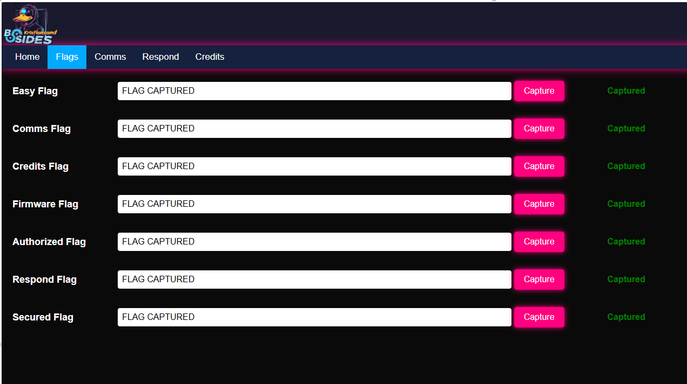

# BSides Kristiansand 2025 Badge CTF Writeup

This writeup documents how I reverse-engineered the BSides Kristiansand 2025 badge and captured all flags without following the intended CTF path. Instead, I used serial terminal access over USB, and Python scripting to extract the necessary data directly from the badge.

## Getting Access via Serial

I connected the badge to Linux to check how it appeared on my system. It showed up as a **MicroPython Board in FS mode**, which was confusing because a device in FS mode typically functions as a USB mass storage device rather than a serial interface. However, since the new device was active, I suspected that a serial interface must still be running.

```bash
lsusb
```


I also didn’t want to modify anything on the board itself. My focus was solely on exploring the existing files and understanding how they were implemented.

I ran:

```bash
dmesg | grep tty
```


to check which serial devices were recognized by the system. The output revealed that the Raspberry Pi Pico was detected as a USB ACM device (`/dev/ttyACM0`), confirming that the board was accessible for direct interaction via a terminal or a MicroPython REPL session.

After identifying the device as a USB ACM serial interface, I established a connection using:

```bash
screen /dev/ttyACM0 115200
```


This allowed me to interact with the device in real-time. Letting the session run fully helped me observe its behavior, including any output or responses from the board. I also connected to the **Duck Wi-Fi**, as shown in my setup, to monitor additional network activity.

## Discovering the First Flag

After connecting to the device’s Wi-Fi network, I accessed the local webpage. The device acted as an access point (`DUCK-C768FC`). Once connected, I opened the page in a browser and was immediately shown the first flag. This confirmed the system was working and gave me a baseline for future comparisons.


## Exploring the Filesystem

Once in the MicroPython REPL, I hit `CTRL+C` to stop execution and started exploring with:

```python
import os
os.listdir()
```


I identified two key files:

1. `encrypted_db.json` – stores encrypted flags and their names
2. `flagManager.py` – contains logic for encrypting, decrypting, and handling flag data

And later, I opened `encrypted_db.json`, as shown in the above image.
```python
with open("encrypted_db.json") as f:
print(f.read())
```

## Understanding Decryption

Opening `flagManager.py`, I found it handled everything from AES encryption to flag validation. Notably:

- It loads `encrypted_db.json` into a TinyDB object
- Decrypts data using a hardcoded key:
  


```python
encryption_key = b'donothardcodekey'
```


- Decrypts using:
  - Hex decoding
  - AES decryption
  - Padding removal

## How Flags Are Constructed

Each flag is dynamically generated like so:

- `flag_data = to_leet("FLAGNAME_INDEX")`, e.g., `CREDITS_1`
- Final format:

```python
DUCK_{DEVICE_ID}_{LEET_FLAG}_{HASH_SUFFIX}
```


Some flags have fixed suffixes like `_01234`, while others are derived from:
- `device_id = self.device_name.replace("DUCK", "")`
- `suffix = last_5_characters_of_hash(...)`

This matters only if generating new flags, not for decryption.

## Extracting Flags via Python


I noticed that `retrieve_flag(flag)` decrypts and returns the flag directly. Based on the names from `encrypted_db.json`, after some hit and miss, I was able to understand how I could interact with the flagManager class:

```python
import flagManager
fm = flagManager.FlagManager("")
```

Then extract:

```python
fm.retrieve_flag("easy")
fm.retrieve_flag("credits")
fm.retrieve_flag("firmware")
fm.retrieve_flag("comms")
fm.retrieve_flag("authorized")
fm.retrieve_flag("respond")
fm.retrieve_flag("secured")
```


The constructor required a `device_id` argument, but only uses it if `init_flags()` is called. Passing `""` was enough to bypass that.

## Verifying Flags via Web Interface

I reconnected to the DUCK Wi-Fi and opened the badge’s flag submission page. By entering each flag retrieved through RE, I was able to mark them as captured.

Once all were submitted, the badge LEDs changed color to indicate completion.


